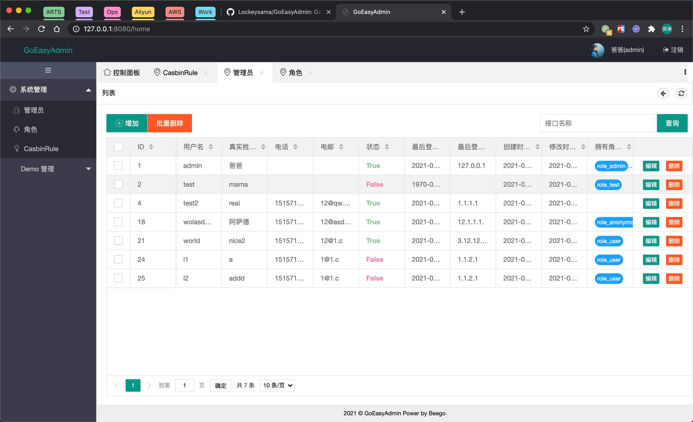
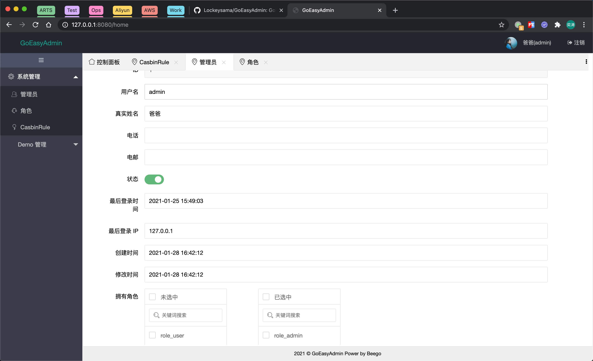
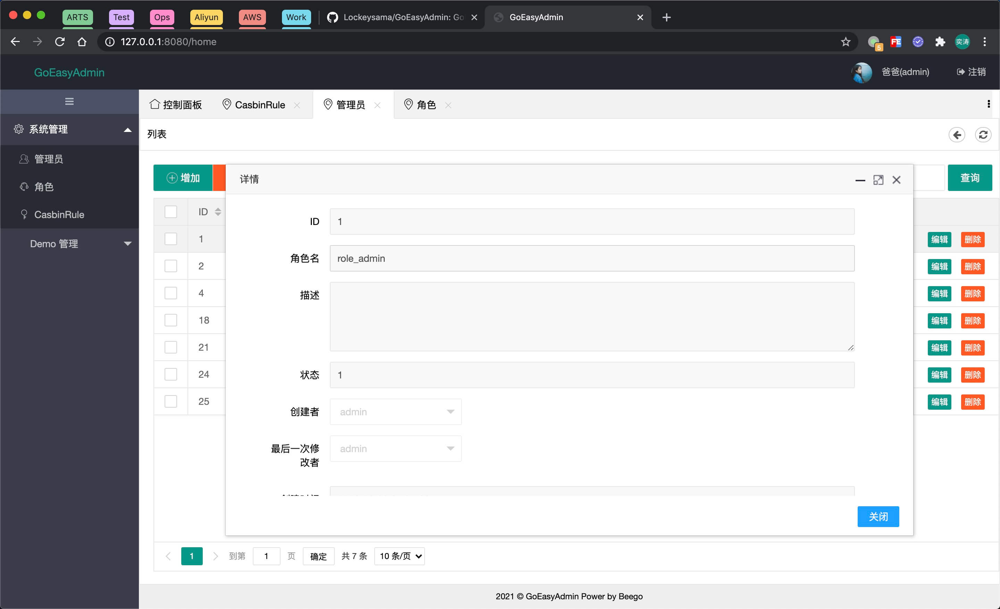

# TDCS

## 简介

TDCS 是一个使用为 Go 语言开发的后端数据管理组件（目前仅支持适配 Beego 2 框架）。它可以根据数据库 Model 自动生成 Casbin 权限规则（并且会开启默认的用户角色管理功能），并根据 Model 动态渲染出管理界面。在 TDCS 的底层代码中，使用了较多的反射，提高了及其灵活动态加载的能力（鉴于 GO 的反射机制，性能会有所下降）。由于底层做了许多动态加载的代码，使得用户在使用 TDCS 的时候，会非常方便。

***列表页***


***编辑页***


***外键详情页***


## 安装

框架尚且未完全开发完成，最终方案暂时未定。目前可以直接下载代码运行，并在此基础上进行修改。

## 使用

### 模型

#### Model Tag —— display

***Example:***

```go
type Admin struct {
	ID          int     `orm:"auto;pk" description:"ID" json:"id" display:"title=ID;dbtype=Number;pk=true"`
	UserName    string  `orm:"unique" description:"用户名" json:"username" display:"title=用户名;dbtype=Char"`
	Password    string  `description:"密码" json:"password" display:"-"`
	RealName    string  `description:" 真实姓名" json:"realname" display:"title=真实姓名;dbtype=Char"`
	Phone       string  `description:"电话" json:"phone" display:"title=电话;dbtype=Char"`
	Email       string  `description:"电邮" json:"email" display:"title=电邮;dbtype=Char"`
	Status      bool    `description:"状态" json:"status" display:"title=状态;dbtype=Bool"`
	LastLogin   int64   `orm:"auto_now" description:"最后登录时间" json:"lastlogin" display:"title=最后登录时间;dbtype=Datetime"`
	LastIP      string  `description:"最后登录 IP" json:"lastip" display:"title=最后登录 IP;dbtype=Char"`
	CreatedTime int64   `orm:"auto_now_add" description:"创建时间" json:"createdtime" display:"title=创建时间;dbtype=Datetime"`
	UpdatedTime int64   `description:"修改时间" json:"updatedtime" display:"title=修改时间;dbtype=Datetime"`
	Roles       []*Role `orm:"rel(m2m)" description:"拥有角色" json:"roles" display:"title=拥有角色;dbtype=M2M;showfield=Name;index=ID"`
}
```

如上所示，在数据库模型定义时，加入了一个专门为 TDCS 服务的 `display` Tag。具体定义见下表：

字段 | 值 | 描述 | 备注
---|---|---|---
Field | 同数据 Model 字段名
PK | true/false | 是否 Model 主键 | 默认 false
Title | 自定义 | 管理后台显示的字段列名
DBType | Char/Number/Bool/M2M/O2O/ForeignKey/Datetime | 数据库字段类型 | 不同类型有其特别的显示方式，默认为：intXXX 对应 Number（可设置为 Datetime）；string 对应 Char；bool 对应 Bool；切片对应 M2M；struct 对应 ForeignKey（可设置为 O2O）
Required | true/false | 表单是否必须输入内容
ShowField | 自定义 | 字段为 M2M/O2O/ForeignKey 的情况下，在管理后台展示的字段
Index | 自定义 | 字段为 M2M/O2O/ForeignKey 的情况下，在管理后台用于索引的字段
Help | 自定义 | 字段帮助信息

### 控制器

***Example:***

```go
import (
	geacontrollers "github.com/lockeysama/go-easy-admin/controllers/base"
)

// AdminBaseController 管理面板基础类
type AdminBaseController struct {
	geacontrollers.ManageBaseController
}

// Prefix 前缀
func (c *AdminBaseController) Prefix() string {
	return "/admin"
}

// PrefixAlias 前缀别名
func (c *AdminBaseController) PrefixAlias() string {
	return "系统管理"
}

// PrefixIcon 管理界面一级侧栏图标
func (c *AdminBaseController) PrefixIcon() string {
	return "layui-icon-set"
}
```

同模块的不同控制器可以使用相同的基础类，方便分类。基础类继承 `baseController组的路由前缀、分组别名、分组图标（使用 layui 图标库）。

```go
import (
	geamodels "github.com/lockeysama/go-easy-admin/models/admin"
	geamodels "github.com/lockeysama/go-easy-admin/geadmin/models"
)

// AdminController
type AdminController struct {
	AdminBaseController
}

// DBModel 返回控制器对应的数据库模型
func (c *AdminController) DBModel() geamodels.Model {
	return &geamodels.Admin{}
}

// AdminNameAlias 设置控制器侧栏别名
func (c *AdminController) AdminNameAlias() string {
	return "管理员"
}

// AdminIcon 管理界面侧栏图标
func (c *AdminController) AdminIcon() string {
	return "layui-icon-user"
}
```

控制器继承分组控制器，重写 DBModel 来指定控制器对应的数据库模型。并可以通过重写 AdminNameAlias、AdminIcon 来自定义模型别名和模型对应的图标。

## 路由

### 控制器注册

***Example:***

```go
import (
	geacontrollers "github.com/lockeysama/go-easy-admin/controllers/admin"
	geacontrollers "github.com/lockeysama/go-easy-admin/controllers/base"
	democontrollers "github.com/lockeysama/go-easy-admin/controllers/demo"

	beego "github.com/beego/beego/v2/server/web"
)

func init() {
	beego.Router("/", &geacontrollers.APIDocController{}, "*:Index")
	beego.Router("/login", &geacontrollers.LoginController{}, "*:LoginIn")
	beego.Router("/login_out", &geacontrollers.LoginController{}, "*:LoginOut")
	beego.Router("/no_auth", &geacontrollers.LoginController{}, "*:NoAuth")

	beego.Router("/home", &geacontrollers.HomeController{}, "*:Index")
	beego.Router("/home/start", &geacontrollers.HomeController{}, "*:Start")
	beego.AutoRouter(&geacontrollers.APIDocController{})

	ns := beego.NewNamespace("/admin",
		NSAutoRouter(&geacontrollers.AdminController{}),
		NSAutoRouter(&geacontrollers.RoleController{}),
		NSAutoRouter(&geacontrollers.CasbinController{}),
	)
	beego.AddNamespace(ns)

	ns = beego.NewNamespace("/demo",
		NSAutoRouter(&democontrollers.TestController{}),
	)
	beego.AddNamespace(ns)
}

// AutoRouter 注册路由并注册 CasbinRule 和 SideTree
func AutoRouter(c geacontrollers.GEARolePolicy) *beego.HttpServer {
	geacontrollers.RegisterGEARolePolicy(c)
	geacontrollers.RegisterSideTree(c)
	return beego.AutoRouter(c.(beego.ControllerInterface))
}

// NSAutoRouter 注册路由并注册 CasbinRule 和 SideTree
func NSAutoRouter(c geacontrollers.GEARolePolicy) beego.LinkNamespace {
	geacontrollers.RegisterGEARolePolicy(c)
	geacontrollers.RegisterSideTree(c)
	return beego.NSAutoRouter(c.(beego.ControllerInterface))
}
```

控制器注册路由时，通过 TDCS 自定义的的 AutoRouter、NSAutoRouter 方法将控制器注册到 CasbinRule 中。
